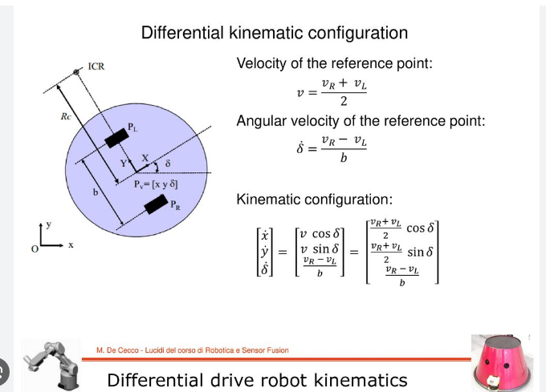

# C++ and Python Template for simple ROS2 based simulation for control autonomous mobile robot
This Docker image is a template for creating simple simulation for AMR path planning/control

Following AMR model has been used to demonstrate the example:

reference : [https://slideplayer.com/slide/13445734/](https://slideplayer.com/slide/13445734/)

# Docker Image Installation 
Following two steps will create the Docker Image **mp_ros2**
1. Change the root directory name in `scripts/deploy/base.sh` 
2. From root of the directory  run  `./scripts/build/build.sh`

# To run the docker Conatiner

Following step will create a docker container **template** and run it in intractive mode

1. From root of the directory run `./scripts/deploy/devel.sh`

# Following steps will build the package

1. make sure you are in ros2 workspace. If you have followed above steps then change the directory to root/workspace/
2. run `colcon build`
3. run `source install/setup.bash`

# Following will run the simulation
1. After building the package, you can run the following launch files
2. run `ros2 launch sim_dynamics sim_dynamics_node.launch.py`  // this will run the simulation node
3. run `ros2 launch planner_algo mppi_node.launch.py` // this will run the mppi_node.py , which currently just transmits the constant speed and 0 steering angle

## License
MIT  

## Use Case
I initiated this project to independently study algorithms and software development for autonomous vehicle systems. This repository is also available for your personal use in studying, education, research, or development.

If this project supports your work or contributes to your tasks, please feel free to inform me by starring the repository.

## Contribution
Any contribution by creating an issue or sending a pull request is welcome!! 
<!-- Please check [this document about how to contribute](/HOWTOCONTRIBUTE.md).   -->

## Author
[Prajwal Thakur](https://github.com/prajwalthakur) 

